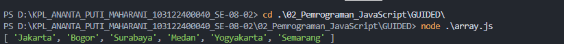
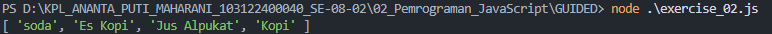
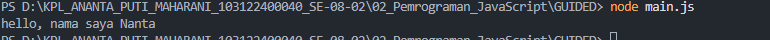

# 📌 Tugas Guided 02 – Pemrograman JavaScript

---

## 👩‍💻 Identitas Mahasiswa

**Nama** : Ananta Puti Maharani  
**NIM** : 103122400040  
**Kelas** : SE-08-02  

**Dosen Pengampu** : Yudha Islami Sulistiya  

**Asisten Praktikum** :  
- Adhiansyah Muhammad Pradana Farawowan  
- Hamid Khaeruman  

---

## 💻 Kode Sumber

Program pada tugas ini terdiri dari beberapa file JavaScript berikut:

- [`array.js`](./array.js)  
- [`exercise_02.js`](./exercise_02.js)  
- [`exercise.js`](./exercise.js)  
- [`main.js`](./main.js)  

---

## 🖥️ Output Program

Berikut hasil output ketika program dijalankan pada terminal:

**Output `array.js`**

**Output `exercise_02.js`**

**Output `exercise.js`**

**Output `main.js`**

---

## 📝 Deskripsi Program

### 📄 `array.js` – Manipulasi Array Kota
File ini berisi program JavaScript yang melakukan manipulasi array berisi nama-nama kota. Beberapa metode array yang digunakan antara lain `push()`, `pop()`, `slice()`, serta perubahan nilai menggunakan indeks array. Program menambahkan kota baru, menghapus elemen terakhir, serta mengubah nilai pada indeks tertentu sebelum menampilkan seluruh isi array menggunakan `console.log()`.

### 📄 `exercise_02.js` – Array Minuman Favorit
File ini berisi program yang membuat sebuah array berisi tiga minuman favorit. Dua elemen pertama pada array kemudian diubah menggunakan notasi kurung (index assignment). Setelah itu, program menambahkan minuman baru pada bagian awal array menggunakan metode `unshift()`. Hasil akhir array kemudian ditampilkan pada console.

### 📄 `exercise.js` – Fungsi Penjumlahan 1 hingga N
File ini berisi sebuah fungsi bernama `sumUpToN(N)` yang digunakan untuk menghitung jumlah bilangan dari 1 hingga N menggunakan perulangan `for`. Nilai penjumlahan disimpan dalam variabel `sum`, kemudian fungsi mengembalikan hasil tersebut dan menampilkannya menggunakan template string.

### 📄 `main.js` – Variabel dan Template String
File ini berisi contoh sederhana penggunaan variabel dan template string dalam JavaScript. Sebuah variabel `nama` menyimpan nilai string, kemudian ditampilkan ke console menggunakan template literal dengan format `${}` untuk menyisipkan nilai variabel ke dalam sebuah kalimat.