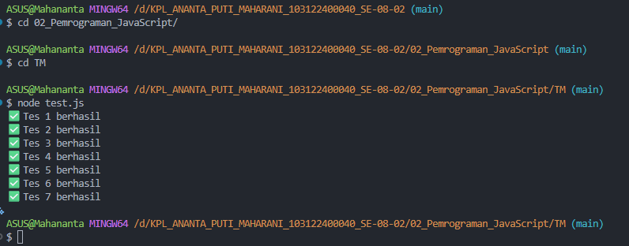

# Tugas Mandiri 02: Pemrograman JavaScript

Penjelasan Program

Program ini bertujuan untuk memproses sebuah array berisi angka dan mengubah setiap angka berdasarkan aturan kelipatan tertentu. Adapun aturan yang digunakan adalah sebagai berikut:

Jika angka kelipatan 14 atau bernilai 0 → diganti menjadi "FizzBuzz"

Jika angka kelipatan 2 → diganti menjadi "Fizz"

Jika angka kelipatan 7 → diganti menjadi "Buzz"

Jika bukan kelipatan 2, 7, atau 14 → angka ditampilkan seperti aslinya

⚠️ Catatan:
Kelipatan 14 harus diperiksa terlebih dahulu, karena 14 merupakan kelipatan 2 dan 7 sekaligus.

Selain itu, program juga melakukan validasi input. Jika input yang diberikan bukan array, maka program akan menampilkan pesan "Input tidak valid". Program kemudian diuji menggunakan test.js

