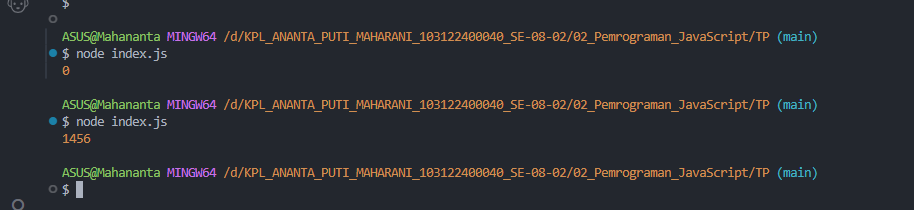
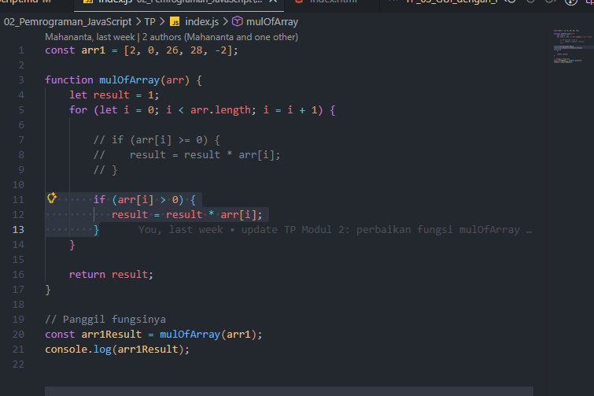
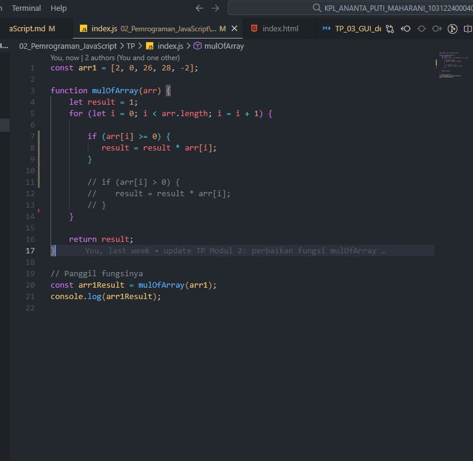

# 📌Tugas Pendahuluan 02 – Pemrograman JavaScript

Repository ini berisi implementasi program JavaScript untuk menyelesaikan tugas **Modul 2 Pemrograman JavaScript**.

---

## 👩‍💻 Identitas Mahasiswa

**Nama** : Ananta Puti Maharani  
**NIM** : 103122400040  
**Kelas** : SE-08-02  

**Dosen Pengampu** : Yudha Islami Sulistiya  
**Asisten Praktikum** :  
- Adhiansyah Muhammad Pradana Farawowan  
- Hamid Khaeruman  

---

# 📖 Soal

Kamu sudah menulis fungsi mulOfArray. Ujilah dengan input [2, 0, 26, 28, -2], dengan output yang seharusnya adalah 1456. Jika kamu menemukan bahwa hasilnya berbeda, bisakah kamu memperbaikinya? Jika kamu menemukan bahwa hasilnya sama, bisakah kamu menjelaskan mengapa demikian?

---

# 💻 Kode Sumber
File Sumber Tersedia :
- [`index.js`](./index.js)

---
# 🖥️ Output Program

Berikut hasil output ketika program dijalankan di terminal:

---
# 📝 Deskripsi Program
Awalnya program ini masih memakai kondisi arr[i] >= 0. Artinya, semua angka yang nilainya nol ke atas ikut dihitung dalam perkalian. Masalahnya, di dalam array ada angka 0, dan begitu angka 0 ikut dikali, hasil akhirnya pasti jadi 0 berapa pun angka lainnya. Makanya waktu kode masih pakai >= 0, hasil akhirnya selalu 0, karena perhitungannya jadi: 2 × 0 × 26 × 28 = 0.

Setelah kode diperbaiki, kondisinya diganti menjadi arr[i] > 0. Dengan kondisi ini, angka 0 tidak ikut dihitung, jadi yang dikalikan hanya angka yang benar-benar positif. Nah, angka positif di array tersebut adalah 2, 26, dan 28 saja. Jadi perhitungannya berubah menjadi: 2 × 26 × 28, dan hasilnya 1456.
