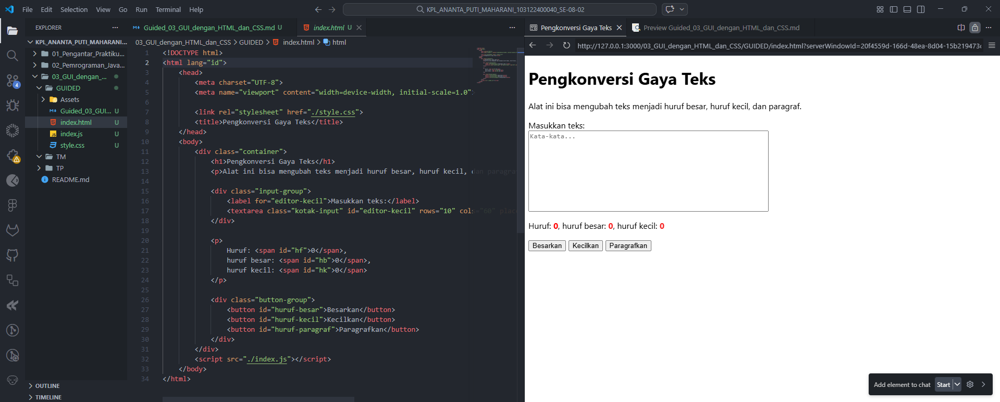

# 📌Guided 03 – GUI dengan HTML dan CSS

---
## 👩‍💻 Identitas Mahasiswa

**Nama** : Ananta Puti Maharani  
**NIM** : 103122400040  
**Kelas** : SE-08-02  

**Dosen Pengampu** : Yudha Islami Sulistiya  

**Asisten Praktikum** :  
- Adhiansyah Muhammad Pradana Farawowan  
- Hamid Khaeruman  

---

## 📖 Soal

Buatlah sebuah tata letak halaman web yang berada di **tengah halaman** seperti contoh yang diberikan. Selain itu, ubah jenis font yang digunakan pada halaman menjadi **Inconsolata** yang diambil dari **Google Fonts**.

---

## 💻 Kode Sumber

Program ini terdiri dari beberapa file berikut:

- [`index.html`](./index.html) → berisi struktur utama halaman web  
- [`style.css`](./style.css) → berisi pengaturan tampilan dan tata letak halaman  
- [`index.js`](./index.js) → berisi logika JavaScript untuk memproses teks  

---

## 🖥️ Output Program

Berikut tampilan halaman ketika dijalankan pada browser:

---

## 📝 Deskripsi Program

Program ini merupakan sebuah **alat pengkonversi gaya teks** yang dibuat menggunakan **HTML, CSS, dan JavaScript**.

Pada bagian HTML, halaman berisi sebuah **textarea** yang digunakan untuk memasukkan teks serta beberapa tombol untuk mengubah gaya teks. Selain itu terdapat informasi yang menampilkan jumlah huruf, jumlah huruf besar, dan jumlah huruf kecil dari teks yang dimasukkan.

Tampilan halaman diatur menggunakan **CSS** dengan membungkus seluruh elemen dalam sebuah **container**. Container diberikan pengaturan `max-width` dan `margin: auto` sehingga posisi halaman berada di **tengah layar**. Selain itu, halaman menggunakan font **Inconsolata** dari Google Fonts agar tampilan teks lebih konsisten dan mudah dibaca.

Pada bagian **JavaScript**, program digunakan untuk:
- Menghitung jumlah huruf yang diketik pengguna
- Menghitung jumlah huruf besar dan huruf kecil
- Mengubah teks menjadi huruf besar
- Mengubah teks menjadi huruf kecil
- Mengubah teks menjadi format paragraf (setiap kata diawali huruf kapital)

Setiap perubahan pada teks akan langsung memperbarui informasi jumlah huruf secara otomatis sehingga pengguna dapat melihat perubahan secara langsung.