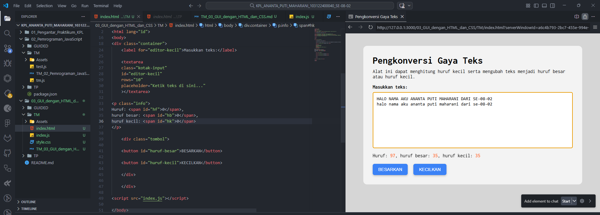

# 📌Tugas Mandiri 03 – GUI dengan HTML dan CSS
Repository ini berisi implementasi program **GUI berbasis HTML, CSS, dan JavaScript** untuk menyelesaikan tugas **Modul 3 GUI dengan HTML dan CSS**.

---

## 👩‍💻 Identitas Mahasiswa

**Nama** : Ananta Puti Maharani  
**NIM** : 103122400040  
**Kelas** : SE-08-02  

**Dosen Pengampu** : Yudha Islami Sulistiya  
**Asisten Praktikum** :  
- Adhiansyah Muhammad Pradana Farawowan  
- Hamid Khaeruman  

---

## 📖 Soal

Setelah menyelesaikan tugas pendahuluan, buatlah sebuah alat berbasis web yang dapat memproses teks menggunakan **HTML, CSS, dan JavaScript**.

Terapkan fungsi berikut:

1. Menghitung jumlah **huruf kecil** pada teks dan menampilkannya pada elemen `#hk`.
2. Mengubah huruf kecil menjadi **huruf besar** ketika pengguna menekan tombol `#huruf-besar`.
3. Mengubah huruf besar menjadi **huruf kecil** ketika pengguna menekan tombol `#huruf-kecil`.

Untuk nomor **2 dan 3**, hasil perubahan teks harus **ditampilkan kembali pada textarea `editor-kecil`**.

---

# 💻 Kode Sumber

File sumber tersedia pada:

- [`index.html`](./index.html)  
- [`style.css`](./style.css)  
- [`index.js`](./index.js)

---

# 🖥️ Output Program

Berikut tampilan program ketika dijalankan pada browser:

---

# 📝 Deskripsi Program

Program ini merupakan aplikasi sederhana berbasis web yang digunakan untuk **memproses dan mengubah gaya teks** menggunakan JavaScript.

Langkah kerja program adalah sebagai berikut:

1. Pengguna memasukkan teks pada **textarea** yang tersedia pada halaman web.
2. Program membaca teks tersebut menggunakan **JavaScript** melalui DOM.
3. Sistem kemudian menghitung jumlah:
   - seluruh karakter
   - huruf besar (`A-Z`)
   - huruf kecil (`a-z`)
4. Jumlah huruf kecil akan ditampilkan pada elemen **`#hk`**.
5. Ketika tombol **BESARKAN** ditekan, teks akan diubah menjadi huruf besar menggunakan fungsi `toUpperCase()`.
6. Ketika tombol **KECILKAN** ditekan, teks akan diubah menjadi huruf kecil menggunakan fungsi `toLowerCase()`.
7. Hasil perubahan teks akan langsung ditampilkan kembali pada **textarea `editor-kecil`**.
8. Fitur **Paragrafkan** dihapus dari program sesuai dengan instruksi terbaru dari asisten praktikum.

Program ini memanfaatkan **DOM Manipulation** pada JavaScript untuk membaca input pengguna, menghitung jumlah huruf, serta mengubah isi teks secara dinamis.