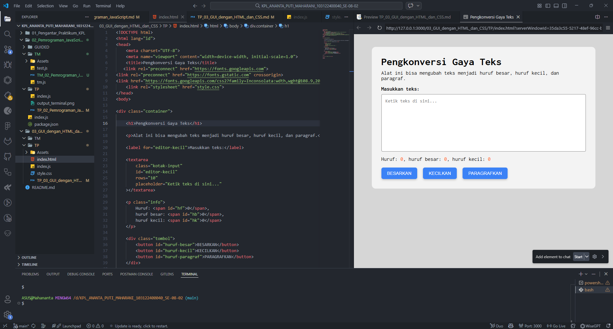

# 📌Tugas Pendahuluan 03 – GUI dengan HTML dan CSS

Repository ini berisi implementasi program HTML dan CSS untuk menyelesaikan tugas **Modul 3 GUI dengan HTML dan CSS**.

---

## 👩‍💻 Identitas Mahasiswa
**Nama** : Ananta Puti Maharani  
**NIM** : 103122400040  
**Kelas** : SE-08-02  

**Asisten Praktikum** :  
- Adhiansyah Muhammad Pradana Farawowan  
- Hamid Khaeruman  

---

## 📖 Soal
Buatlah tata letak laman sehingga seluruh konten halaman berada di **tengah halaman** seperti pada contoh yang diberikan. Selain itu, ubah jenis font yang digunakan pada halaman menjadi **Inconsolata** yang diambil dari **Google Fonts**.

---

## 💻 Kode Sumber
Program ini dibuat menggunakan beberapa file berikut:

- [`index.html`](./index.html) → berisi struktur utama halaman web  
- [`style.css`](./style.css) → berisi pengaturan tampilan dan tata letak halaman  
- [`index.js`](./index.js) → berisi script JavaScript yang digunakan pada halaman 

---

## 🖥️ Output
Berikut tampilan halaman ketika dijalankan pada browser:

---

## 📝 Deskripsi
Tata letak halaman dapat berada di tengah karena seluruh elemen dibungkus di dalam sebuah **container**. Pada CSS, container diberi pengaturan **max-width** untuk membatasi lebar halaman dan **margin: auto** untuk membuat margin kiri dan kanan otomatis. Ketika margin kiri dan kanan bernilai otomatis, browser akan membagi ruang kosong secara seimbang sehingga container berada di tengah halaman. Akibatnya tampilan yang awalnya berada di pinggir menjadi terpusat dan lebih rapi..