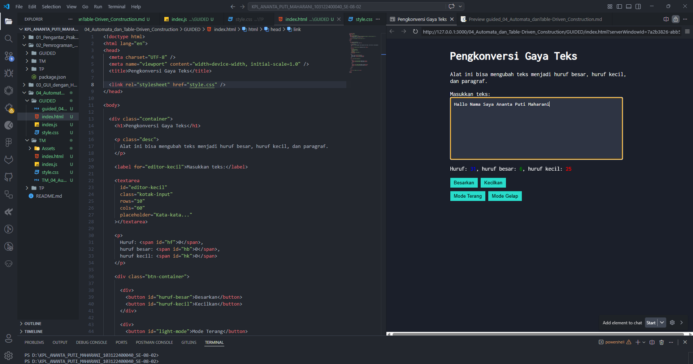

# 📌Guided – Automata dan Table-Driven Construction

Repository ini berisi implementasi program hasil **Guided Modul 4 Automata dan Table-Driven Construction**.

---

## 👩‍💻 Identitas Mahasiswa

**Nama** : Ananta Puti Maharani
**NIM** : 103122400040
**Kelas** : SE-08-02

**Asisten Praktikum** :

* Adhiansyah Muhammad Pradana Farawowan
* Hamid Khaeruman
---

## 💻 Program / Kode

Program tersedia pada file berikut:

* [`index.html`](./index.html) → struktur halaman web
* [`style.css`](./style.css) → tampilan dan layout halaman
* [`index.js`](./index.js) → logika program dan interaksi pengguna

---

## 🖥️ Output

---
## 📝 Deskripsi

Proyek ini merupakan aplikasi web sederhana untuk mengubah gaya teks secara real-time. Pengguna dapat mengonversi teks menjadi huruf besar atau huruf kecil, serta melihat jumlah karakter secara langsung.

Tampilan halaman diatur menggunakan CSS dengan Flexbox agar berada di tengah, serta menggunakan font Inconsolata dari Google Fonts. Fitur interaktif dikembangkan dengan JavaScript, termasuk perhitungan karakter dan perubahan mode terang serta gelap.

Konsep Automata diterapkan melalui perubahan state tampilan berdasarkan interaksi pengguna.
