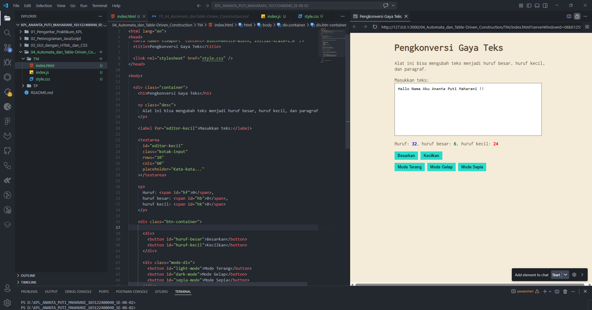

# 📌Tugas Mandiri 04 – Automata dan Table-Driven Construction

Repository ini berisi implementasi program untuk menyelesaikan tugas **Modul 4 Automata dan Table-Driven Construction**.

---

## 👩‍💻 Identitas Mahasiswa

**Nama** : Ananta Puti Maharani
**NIM** : 103122400040
**Kelas** : SE-08-02

**Asisten Praktikum** :

* Adhiansyah Muhammad Pradana Farawowan
* Hamid Khaeruman

---

## 📖 Soal

Tambahkan fitur **mode gelap (dark mode)** pada aplikasi pengkonversi gaya teks.
Ketika pengguna menekan tombol **Mode Gelap**, tampilan aplikasi harus berubah dengan ketentuan berikut:

* Background pada **#editor-kecil** berubah menjadi warna `#2e3443`
* Background pada **tombol** berubah menjadi warna `#29ddcc`
* **Border tombol tidak ditampilkan**
* Warna teks pada tombol **tidak diubah**

Selain itu, tombol **Mode Terang** digunakan untuk mengembalikan tampilan ke kondisi awal.

Pada tugas mandiri, ditambahkan fitur **mode sepia** dengan ketentuan:

* Background halaman: `#F4ECD8`
* Warna teks: `#5B4636`
* Form (textarea) tetap berwarna putih
* Tersedia tiga mode: **Light, Dark, dan Sepia**

---

## 💻 Kode Sumber

Program ini dibuat menggunakan beberapa file berikut:

* [`index.html`](./index.html) → berisi struktur utama halaman web
* [`style.css`](./style.css) → berisi pengaturan tampilan dan tema (light, dark, sepia)
* [`index.js`](./index.js) → berisi logika konversi teks dan pengaturan state mode tampilan

---

## 🖥️ Output

---

## 📝 Deskripsi Program

Setiap state merepresentasikan kondisi tampilan yang berbeda. Perpindahan antar state dipicu oleh interaksi pengguna melalui tombol yang tersedia. Hal ini mencerminkan konsep **automata**, di mana sistem berpindah dari satu state ke state lain berdasarkan input (aksi pengguna).

Implementasi dilakukan dengan menambahkan class CSS (`dark-mode` dan `sepia-mode`) pada elemen root (`document.documentElement`). JavaScript digunakan untuk mengatur perpindahan state dengan cara menambahkan atau menghapus class tersebut secara dinamis.

Selain itu, pendekatan ini juga mencerminkan konsep **Table-Driven Construction**, di mana perilaku sistem ditentukan berdasarkan kondisi tertentu tanpa menggunakan logika bercabang yang kompleks.
