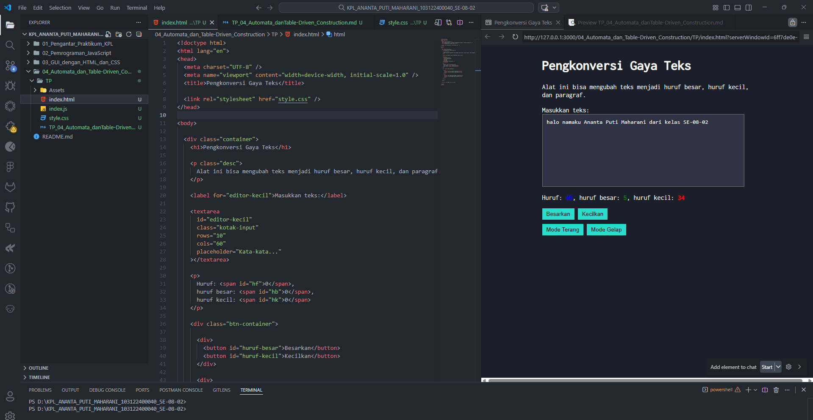

# 📌Tugas Pendahuluan 04 – Automata dan Table-Driven Construction

Repository ini berisi implementasi program untuk menyelesaikan tugas **Modul 4 Automata dan Table-Driven Construction**.

---

## 👩‍💻 Identitas Mahasiswa

**Nama** : Ananta Puti Maharani
**NIM** : 103122400040
**Kelas** : SE-08-02

**Asisten Praktikum** :

* Adhiansyah Muhammad Pradana Farawowan
* Hamid Khaeruman

---

## 📖 Soal

Tambahkan fitur **mode gelap (dark mode)** pada aplikasi pengkonversi gaya teks.
Ketika pengguna menekan tombol **Mode Gelap**, tampilan aplikasi harus berubah dengan ketentuan berikut:

* Background pada **#editor-kecil** berubah menjadi warna `#2e3443`
* Background pada **tombol** berubah menjadi warna `#29ddcc`
* **Border tombol tidak ditampilkan**
* Warna teks pada tombol **tidak diubah**

Selain itu, tombol **Mode Terang** digunakan untuk mengembalikan tampilan ke kondisi awal.

---

## 💻 Kode Sumber

Program ini dibuat menggunakan beberapa file berikut:

* [`index.html`](./index.html) → berisi struktur utama halaman web
* [`style.css`](./style.css) → berisi pengaturan tampilan dan mode gelap
* [`index.js`](./index.js) → berisi script JavaScript untuk konversi teks dan pengaturan mode tampilan

---

## 🖥️ Output

Berikut tampilan halaman ketika dijalankan pada browser:

---

## 📝 Deskripsi

Pada tugas ini ditambahkan fitur **mode gelap** pada aplikasi. Fitur ini diimplementasikan dengan menambahkan sebuah **class CSS bernama `dark-mode`** yang akan diterapkan pada elemen `body` ketika tombol **Mode Gelap** ditekan.

Class `dark-mode` berisi pengaturan tampilan yang berbeda dari mode normal, seperti perubahan warna background dan tombol. Ketika class ini aktif, background pada textarea **#editor-kecil** berubah menjadi `#2e3443` dan tombol berubah menjadi warna `#29ddcc` tanpa border.

Perubahan mode dilakukan menggunakan **JavaScript event listener** pada tombol **Mode Gelap** dan **Mode Terang**. Saat tombol Mode Gelap ditekan, JavaScript menambahkan class `dark-mode` pada body sehingga tampilan halaman berubah. Sebaliknya, ketika tombol Mode Terang ditekan, class tersebut dihapus sehingga tampilan kembali ke mode awal.
