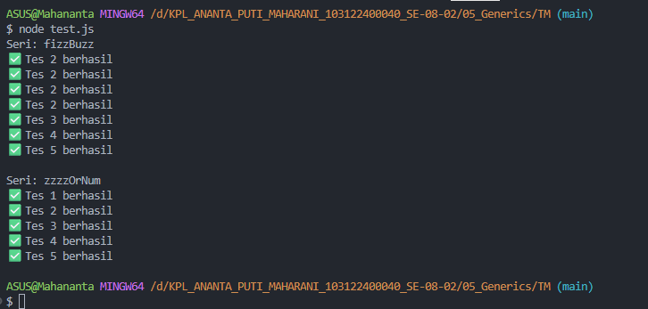

# 📌Tugas Mandiri 05 – Generics

Repository ini berisi implementasi program untuk menyelesaikan tugas **Modul 5 Generics (Tugas Mandiri)**.

---

## 👩‍💻 Identitas Mahasiswa

**Nama** : Ananta Puti Maharani
**NIM** : 103122400040
**Kelas** : SE-08-02

**Asisten Praktikum** :

* Adhiansyah Muhammad Pradana Farawowan
* Hamid Khaeruman

---

## 📖 Soal

Membuat FizzBuzz dengan aturan kali ini adalah:

1.Fungsi fizzBuzz hanya menerima larik yang semua elemennya terdiri dari bilangan bulat dan mengeluarkan larik pula yang bisa jadi bercampur string dan bilangan 2.Fungsi zzzzOrNum hanya menerima sebuah data tunggal berupa bilangan bulat dan mengembalikan "Fizz", "FizzBuzz", "Buzz", atau bilanga bulat sesuai logikanya 3.Kedua fungsi harus ada dan harus disertai JSDoc sesuai tipe data yang disiratkan dari no. 1, no. 2, dan perilaku yang diharapkan di bawah fizzBuzz harus menggunakan fungsi zzzzOrNum di dalamnya

---

## 💻 Kode Sumber

Program ini dibuat menggunakan beberapa file berikut:

* [`fizz.js`](./fizz.js) → berisi implementasi fungsi `fizzBuzz` dan `zzzzOrNum`
* [`test.js`](./test.js) → berisi pengujian program menggunakan assert

---

## 🖥️ Output

---

## 📝 Deskripsi

Pada tugas ini diimplementasikan program **FizzBuzz** menggunakan JavaScript dengan pendekatan tipe data yang lebih terstruktur melalui **JSDoc**.

Fungsi `zzzzOrNum` digunakan untuk menentukan hasil berdasarkan aturan FizzBuzz, yaitu mengembalikan "Fizz", "Buzz", "FizzBuzz", atau angka itu sendiri. Sementara itu, fungsi `fizzBuzz` digunakan untuk memproses seluruh elemen dalam array dengan memanfaatkan fungsi tersebut.

Selain itu, program juga dilengkapi dengan validasi input untuk memastikan data yang diproses sesuai dengan tipe yang diharapkan. Dengan penggunaan JSDoc, kode menjadi lebih jelas dalam mendefinisikan tipe data meskipun JavaScript bersifat dinamis.

