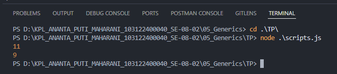

# 📌Tugas Pendahuluan 05 – Generics

Repository ini berisi implementasi program untuk menyelesaikan tugas **Modul 5 Generics**.

---

## 👩‍💻 Identitas Mahasiswa

**Nama** : Ananta Puti Maharani
**NIM** : 103122400040
**Kelas** : SE-08-02

**Asisten Praktikum** :

* Adhiansyah Muhammad Pradana Farawowan
* Hamid Khaeruman

---

## 📖 Soal

Diberikan dua proses perhitungan, yaitu menghitung jumlah seluruh karakter dan menghitung jumlah huruf (tanpa spasi).

Buatlah **satu fungsi generik** yang dapat menangani kedua proses tersebut hanya dengan satu fungsi.

---

## 💻 Kode Sumber

Program ini dibuat menggunakan file berikut:

* [`scripts.js`](./scripts.js) → berisi fungsi generik untuk menghitung karakter

---

## 🖥️ Output

---

## 📝 Deskripsi Program

Pada tugas ini dibuat sebuah fungsi generik bernama `hitung` yang digunakan untuk menghitung jumlah karakter berdasarkan jenis perhitungan yang diinginkan.

Fungsi ini menerima dua parameter, yaitu string dan tipe perhitungan (`"semua"` atau `"huruf"`). Jika tipe `"semua"`, maka seluruh karakter dihitung. Jika tipe `"huruf"`, maka spasi tidak dihitung.

Pendekatan ini mencerminkan konsep **generics**, di mana satu fungsi dapat digunakan untuk berbagai kebutuhan tanpa harus membuat fungsi terpisah. Dengan demikian, kode menjadi lebih efisien, ringkas, dan mudah dipelihara.
