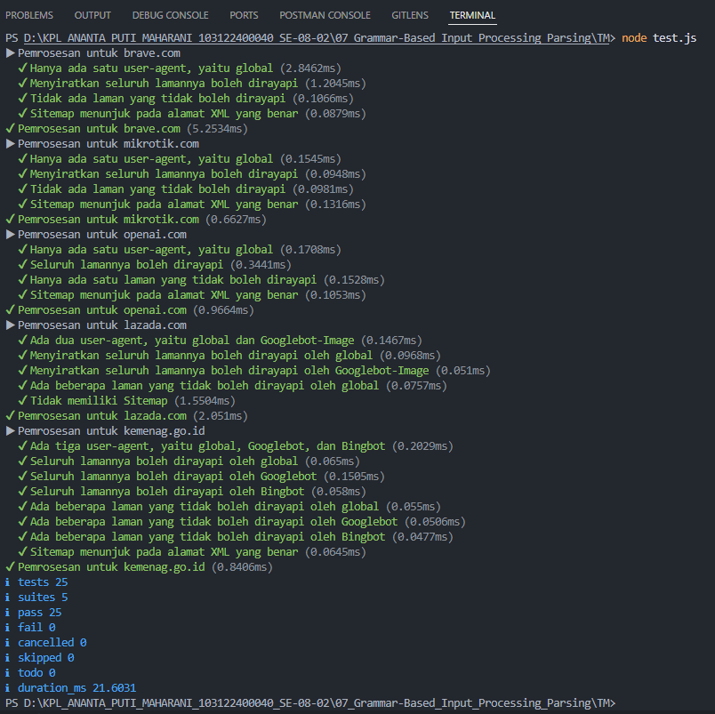

# 📌 Tugas Mandiri 07 – Grammar-Based Input Processing

Repository ini berisi implementasi program untuk menyelesaikan tugas **Modul 7 Grammar-Based Input Processing (Parsing)**.

---

## 👩‍💻 Identitas Mahasiswa

**Nama** : Ananta Puti Maharani
**NIM** : 103122400040
**Kelas** : SE-08-02

**Asisten Praktikum** :

* Adhiansyah Muhammad Pradana Farawowan
* Hamid Khaeruman

---

## 📖 Soal

Buatlah sebuah fungsi bernama **`parseRobots`** yang dapat menguraikan isi dari file `robots.txt` menjadi **POJO (Plain Old JavaScript Object)**.

Properti yang harus diuraikan adalah:

* **User-agent** → nama robot perayap
* **Allow** → daftar halaman yang boleh dirayapi
* **Disallow** → daftar halaman yang tidak boleh dirayapi
* **Sitemap** → alamat peta situs (XML)

Struktur folder yang digunakan:

```plaintext
index.js
test.js
structure.d.ts (opsional)
daftar/
```

---

## 💻 Kode Sumber

Program ini dibuat menggunakan beberapa file berikut:

* [`index.js`](./index.js) → berisi fungsi utama `parseRobots`
* [`test.js`](./test.js) → digunakan untuk menguji hasil parsing
* [`daftar/`](./daftar) → berisi file robots.txt dari berbagai website

---

## 🖥️ Output

Berikut hasil pengujian program menggunakan `node test.js`:



```bash
ℹ pass 25
ℹ fail 0
```

---

## 📝 Deskripsi

Pada tugas ini dibuat fungsi `parseRobots` untuk mengubah isi file `robots.txt` menjadi object JavaScript (POJO).

Parsing dilakukan dengan:

* Memisahkan teks per baris (`split('\n')`)
* Memisahkan key dan value (`split(':')`)
* Membersihkan spasi (`trim()`)

Digunakan **manajemen state** untuk melacak `User-agent` aktif sehingga aturan `Allow` dan `Disallow` dapat dikelompokkan dengan benar.

Hasil parsing disusun dalam bentuk:

```javascript
{
  agents: {
    "*": {
      Allow: [],
      Disallow: []
    }
  },
  Sitemap: []
}
```

Program juga menangani:

* Baris kosong dan komentar
* Perbedaan huruf besar/kecil
* Multiple user-agent
* Nilai kosong pada `Disallow`
* Lebih dari satu `Sitemap`

Hasil pengujian menunjukkan semua test berhasil (**pass 25, fail 0**).
