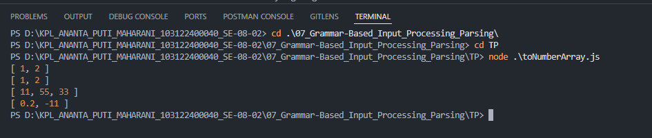

# 📌 Tugas Pendahuluan 07 – Grammar-Based Input Processing

Repository ini berisi implementasi program untuk menyelesaikan tugas **Modul 7 Grammar-Based Input Processing (Parsing)**.

---

## 👩‍💻 Identitas Mahasiswa

**Nama** : Ananta Puti Maharani
**NIM** : 103122400040
**Kelas** : SE-08-02

**Asisten Praktikum** :

* Adhiansyah Muhammad Pradana Farawowan
* Hamid Khaeruman

---

## 📖 Soal

Buatlah fungsi bernama **`toNumberArray`** yang mengubah deretan angka bertipe string menjadi **larik angka**.

Contoh:

```javascript id="a1k2l3"
console.log(toNumberArray("1, 2")) // [1, 2]
console.log(toNumberArray(["1", "2"])) // [1, 2]
console.log(toNumberArray(" 11,55,33   ")) // [11, 55, 33]
console.log(toNumberArray(["0.2", "-11", "abc23"])) // [0.2, -11]
```

---

## 💻 Kode Sumber

Program dibuat dalam satu file utama:

* [`index.js`](./index.js) → berisi fungsi `toNumberArray`

---

## 🖥️ Output

Berikut hasil ketika program dijalankan:



```bash id="b7c9d2"
[1, 2]
[1, 2]
[11, 55, 33]
[0.2, -11]
```

---

## 📝 Deskripsi

Fungsi `toNumberArray` digunakan untuk mengubah input berupa string atau array string menjadi array angka.

Proses yang dilakukan:

* Jika input string → dipisahkan menggunakan `split(",")`
* Membersihkan spasi dengan `trim()`
* Mengubah ke number menggunakan `Number()`
* Memfilter nilai yang bukan angka menggunakan `isNaN()`

Fungsi ini juga mendukung:

* Angka desimal
* Angka negatif
* Mengabaikan nilai yang tidak valid
