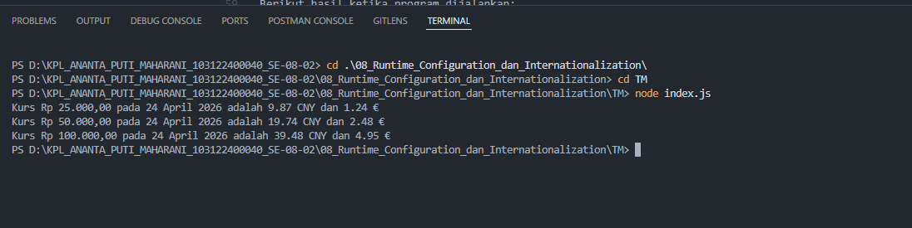

# 📌 Tugas Mandiri 08 – Runtime Configuration dan Internationalization

Repository ini berisi implementasi program untuk menyelesaikan tugas **Modul 8 Runtime Configuration dan Internationalization**.

---

## 👩‍💻 Identitas Mahasiswa

**Nama** : Ananta Puti Maharani  
**NIM** : 103122400040  
**Kelas** : SE-08-02  

**Asisten Praktikum** :

- Adhiansyah Muhammad Pradana Farawowan  
- Hamid Khaeruman  

---

## 📖 Soal

Buat program yang menampilkan kurs rupiah (IDR) terhadap mata uang asing:

- Yuan Tiongkok (CNY)
- Euro (EUR)

Dengan ketentuan:

- Menggunakan API untuk mengambil data kurs
- URL API disimpan di dalam file `.env`
- Menggunakan `Intl` untuk:
  - Format mata uang
  - Format tanggal
- Menghilangkan pesan promosi dari `dotenv`
- Menampilkan output seperti berikut:

plaintext
Kurs Rp25.000,00 pada 23 April 2026 adalah 9.93 CNY dan 1.24 €

Uji program dengan:

Rp25.000
Rp50.000
Rp100.000

---
## 💻 Kode Sumber

Program dibuat dalam beberapa bagian:

index.js
 → berisi logika utama program (fetch API, konversi, formatting)
.env
 → menyimpan URL API

---
## 🖥️ Output

----
## 📝 Deskripsi

Program ini mengambil data kurs mata uang secara real-time dari API, kemudian menampilkan hasil konversi dari rupiah (IDR) ke CNY dan EUR.

Konfigurasi yang digunakan:

.env digunakan untuk menyimpan URL API (runtime configuration)
dotenv untuk membaca environment variable
axios untuk mengambil data dari API
Intl.NumberFormat untuk format mata uang
Intl.DateTimeFormat untuk format tanggal
