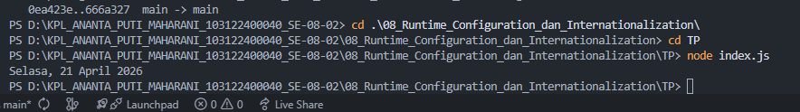

# 📌 Tugas Pendahuluan 08 – Runtime Configuration dan Internationalization

Repository ini berisi implementasi program untuk menyelesaikan tugas **Modul 8 Runtime Configuration dan Internationalization**.

---

## 👩‍💻 Identitas Mahasiswa

**Nama** : Ananta Puti Maharani
**NIM** : 103122400040
**Kelas** : SE-08-02

**Asisten Praktikum** :

* Adhiansyah Muhammad Pradana Farawowan
* Hamid Khaeruman

---

## 📖 Soal

Tampilkan tanggal sekarang dengan format:

```plaintext id="0pq9f3"
Sabtu, 18 April 2026
```

Ketentuan:

* Format harus mengikuti bahasa Indonesia
* Tidak boleh menggunakan string manual
* Wajib menggunakan `Intl.DateTimeFormat`

---

## 💻 Kode Sumber

Program dibuat dalam satu file utama:

* [`index.js`](./index.js) → berisi implementasi formatting tanggal menggunakan `Intl.DateTimeFormat`

---

## 🖥️ Output

Berikut hasil ketika program dijalankan:



```bash id="4f6wzq"
Sabtu, 18 April 2026
```


---

## 📝 Deskripsi

Program ini menampilkan tanggal saat ini dengan format bahasa Indonesia menggunakan `Intl.DateTimeFormat`.

Konfigurasi yang digunakan:

* `locale: 'id-ID'` untuk bahasa Indonesia
* `weekday: 'long'` untuk nama hari
* `day: 'numeric'` untuk tanggal
* `month: 'long'` untuk nama bulan
* `year: 'numeric'` untuk tahun

Pendekatan ini memastikan format tanggal mengikuti standar internasional (i18n) tanpa perlu membuat format secara manual.
