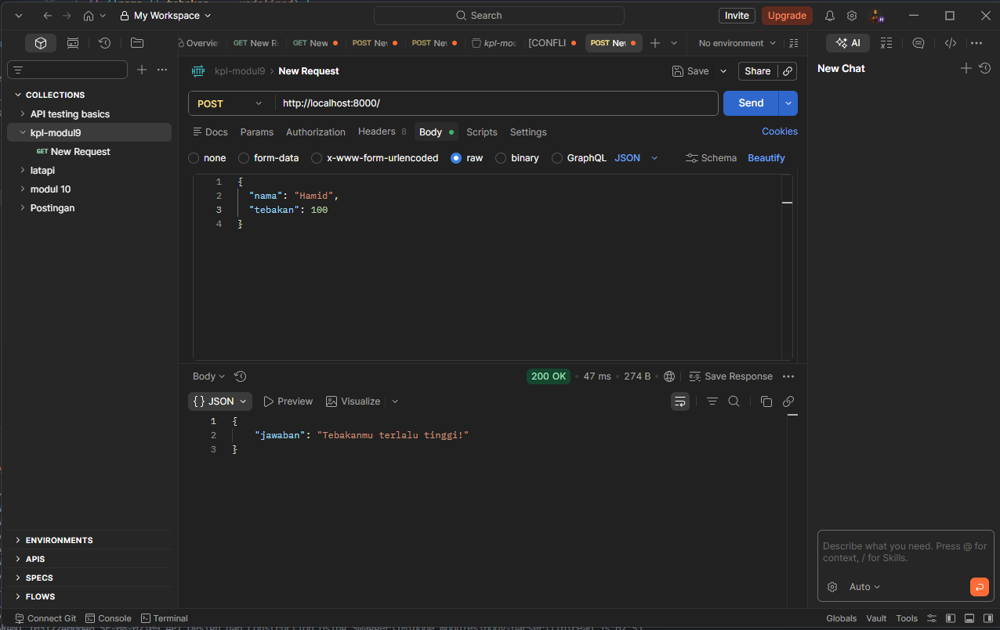
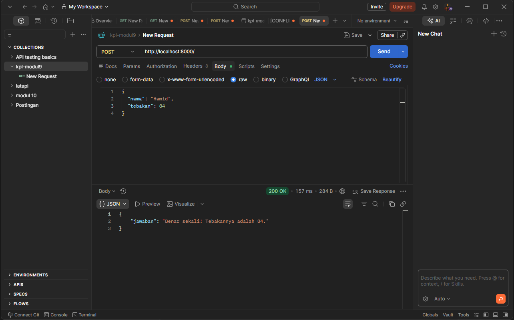
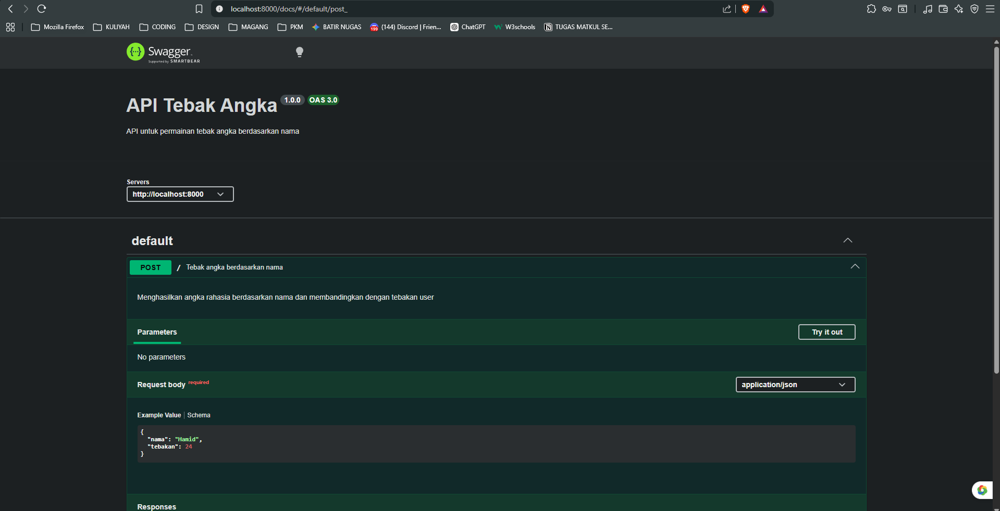

# 📌 Tugas Mandiri 09 – API Tebak Angka

Repository ini berisi implementasi program untuk menyelesaikan tugas **Modul 9 API Design dan Construction (Tugas Mandiri)**.

---

## 👩‍💻 Identitas Mahasiswa

**Nama** : Ananta Puti Maharani  
**NIM** : 103122400040  
**Kelas** : SE-08-02  

**Asisten Praktikum** :

- Adhiansyah Muhammad Pradana Farawowan  
- Hamid Khaeruman  

---

## 📖 Soal

Membuat sebuah API sederhana dengan ketentuan sebagai berikut:

1. Hanya memiliki satu endpoint yaitu **POST /**
2. Menerima input berupa JSON:

{
  "nama": "Hamid",
  "tebakan": 24
}

3. Menghasilkan output:
   - Jika benar → "Benar sekali! Tebakannya adalah X."
   - Jika terlalu tinggi → "Tebakanmu terlalu tinggi!"
   - Jika terlalu rendah → "Tebakanmu terlalu rendah!"

4. Angka harus selalu sama untuk nama yang sama  
5. Rentang angka 1–100  
6. Bersifat case-sensitive  
7. Tidak menggunakan library random  

---

## 💻 Kode Sumber

Program ini dibuat menggunakan beberapa file berikut:

- app.js → berisi implementasi API Express dan logika tebak angka  
- swagger.js → berisi konfigurasi dokumentasi API menggunakan Swagger  

---

## 🖥️ Output

---

## 📝 Deskripsi

Pada tugas ini diimplementasikan sebuah API sederhana menggunakan Express.js untuk permainan tebak angka berbasis nama.

Program menerima input berupa nama dan angka tebakan, kemudian menghasilkan angka rahasia berdasarkan nama tersebut. Angka tidak dihasilkan secara acak, melainkan menggunakan pendekatan deterministic hashing sederhana.

Proses yang dilakukan adalah dengan mengubah setiap karakter pada nama menjadi nilai ASCII menggunakan charCodeAt, kemudian menjumlahkannya dan mengonversinya ke dalam rentang 1–100 menggunakan operasi modulus. Dengan cara ini, setiap nama akan selalu menghasilkan angka yang sama, sehingga memenuhi aturan bahwa hasil harus konsisten.

Endpoint API akan membandingkan nilai tebakan dengan angka rahasia tersebut dan mengembalikan respon sesuai kondisi (benar, terlalu tinggi, atau terlalu rendah).

Program juga dilengkapi dengan dokumentasi API menggunakan Swagger (OpenAPI) sehingga endpoint dapat diuji langsung melalui browser tanpa memerlukan tools tambahan seperti Postman.