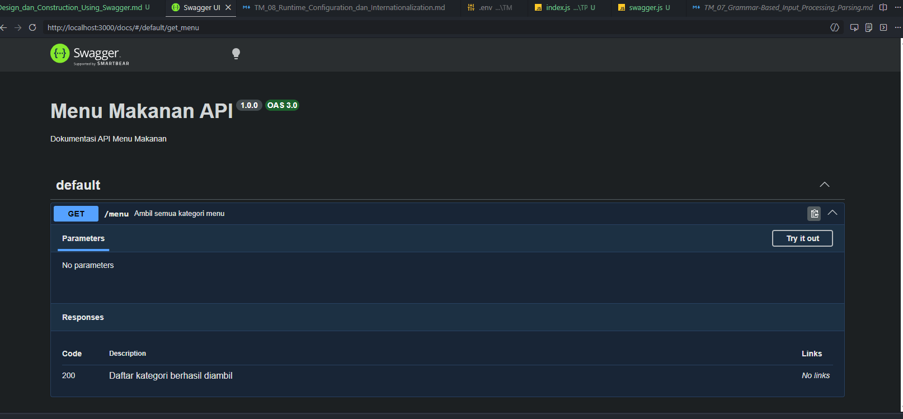
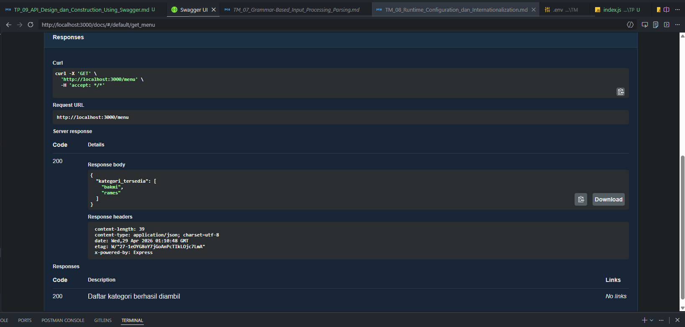

# 📌 Tugas Pendahuluan 09 – OpenAPI dan Endpoint API

Repository ini berisi implementasi program untuk menyelesaikan tugas **Modul 9 OpenAPI dan API Endpoint**.

---

## 👩‍💻 Identitas Mahasiswa

**Nama** : Ananta Puti Maharani  
**NIM** : 103122400040  
**Kelas** : SE-08-02  

**Asisten Praktikum** :

- Adhiansyah Muhammad Pradana Farawowan  
- Hamid Khaeruman  

---

## 📖 Soal

Buatlah satu endpoint API beserta dokumentasi OpenAPI-nya:

- Endpoint: **GET /menu**
- Fungsi: menampilkan daftar semua nama kategori menu yang ada

---

## 💻 Kode Sumber

Program ini dibuat menggunakan beberapa file berikut:

- [`index.js`](./index.js) → berisi server Express dan endpoint API  
- [`swagger.js`](./swagger.js) → konfigurasi dokumentasi OpenAPI (Swagger)  

---

## 🖥️ Output

---
## 📝 Deskripsi

Program ini menggunakan Express.js untuk membuat REST API sederhana dan Swagger (OpenAPI) untuk dokumentasi.

Fitur utama:

Endpoint GET /menu untuk mengambil daftar kategori menu
Data disimpan dalam object JavaScript (menuData)
Menggunakan Object.keys() untuk mengambil nama kategori
Dokumentasi API dibuat menggunakan:
swagger-jsdoc
swagger-ui-express

Alur kerja:

Server dijalankan dengan Express
Data menu disimpan dalam bentuk object
Endpoint /menu dipanggil
Server mengembalikan daftar kategori dalam format JSON
Dokumentasi dapat diakses melalui Swagger UI