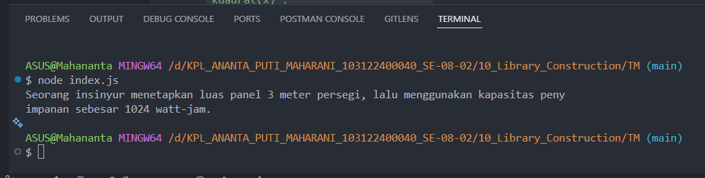

# 📌 Tugas Mandiri 10 – Library Construction

Repository ini berisi implementasi program untuk menyelesaikan tugas **Modul 10 Library Construction**.

---

## 👩‍💻 Identitas Mahasiswa

**Nama** : Ananta Puti Maharani  
**NIM** : 103122400040  
**Kelas** : SE-08-02  

**Asisten Praktikum** :
- Adhiansyah Muhammad Pradana Farawowan  
- Hamid Khaeruman  

---

## 📖 Soal

Buatlah pustaka JavaScript bernama **mtk-gampang** yang menyediakan beberapa fungsi matematika berikut:

- Fungsi `pangkat(x, y)` untuk menghitung perpangkatan
- Fungsi `bulat(x)` untuk membulatkan angka
- Fungsi `kuadrat(x)` untuk menghitung akar kuadrat

Ketentuan:

- Setiap fungsi ditempatkan pada file terpisah di dalam folder `lib`
- Semua fungsi diekspor melalui file `index.js`
- Pustaka harus dapat diinstal dan diimpor ke project lain
- Gunakan pustaka tersebut untuk membuat narasi berikut:

```text
Seorang insinyur menetapkan luas panel 3 meter persegi, lalu menggunakan kapasitas penyimpanan sebesar 1024 watt-jam.
```
---

## 💻 Kode Sumber

### `lib/pangkat.js`

```js
export function pangkat(x, y) {
  return x ** y;
}
```

---

### `lib/bulat.js`

```js
export function bulat(x) {
  return Math.trunc(x);
}
```

---

### `lib/kuadrat.js`

```js
export function kuadrat(x) {
  return Math.sqrt(x);
}
```

---

### `index.js`

```js
export { pangkat } from './lib/pangkat.js';
export { bulat } from './lib/bulat.js';
export { kuadrat } from './lib/kuadrat.js';
```

---

### `package.json`

```json
{
  "name": "mtk-gampang",
  "version": "1.0.0",
  "description": "Library matematika sederhana",
  "main": "index.js",
  "type": "module",
  "license": "ISC"
}
```

---

## 📦 Instalasi Library

Library diinstal secara lokal pada project testing menggunakan perintah berikut:

```bash
npm install ./mtk_gampang
```

---

## 🧪 Pengujian Library

### `TM/index.js`

```js
import { kuadrat, pangkat, bulat } from 'mtk-gampang';

const narasi = `Seorang insinyur menetapkan luas panel ${bulat(kuadrat(12))} meter persegi, lalu menggunakan kapasitas penyimpanan sebesar ${pangkat(2, 10)} watt-jam.`;

console.log(narasi);
```


---

## 💻 Output



---

## 📝 Deskripsi

Pada tugas ini dibuat sebuah pustaka JavaScript bernama `mtk-gampang` yang menyediakan beberapa utilitas matematika sederhana. Library ini terdiri dari tiga fungsi utama yaitu `pangkat(x, y)`, `bulat(x)`, dan `kuadrat(x)`.

Fungsi `pangkat(x, y)` digunakan untuk menghitung nilai perpangkatan menggunakan operator `**`. Fungsi `bulat(x)` digunakan untuk membulatkan angka desimal menjadi bilangan bulat menggunakan `Math.trunc()`. Sedangkan fungsi `kuadrat(x)` digunakan untuk menghitung akar kuadrat dengan `Math.sqrt()`.

Setiap fungsi ditempatkan pada file yang terpisah di dalam folder `lib` agar struktur kode lebih modular dan mudah dipelihara. Seluruh fungsi kemudian diekspor kembali melalui file `index.js` sehingga dapat diimpor dengan lebih mudah pada project lain.
