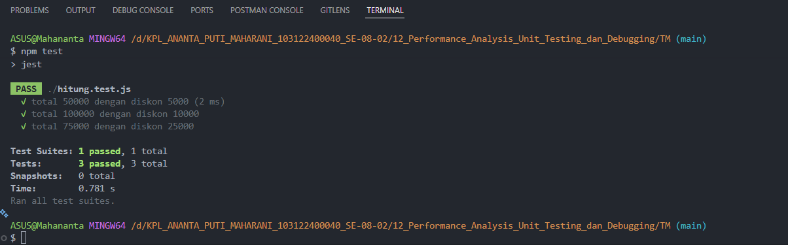

# 📌 Tugas Mandiri 12 – Performance Analysis, Unit Testing, dan Debugging

Repository ini berisi implementasi program untuk menyelesaikan tugas **Modul 12 Performance Analysis, Unit Testing, dan Debugging (Tugas Mandiri)**.

---

## 👩‍💻 Identitas Mahasiswa

**Nama** : Ananta Puti Maharani  
**NIM** : 103122400040  
**Kelas** : SE-08-02  

**Asisten Praktikum** :

- Adhiansyah Muhammad Pradana Farawowan  
- Hamid Khaeruman  

---

## 📖 Soal

Buatlah unit test menggunakan framework **Jest** untuk menguji fungsi perhitungan harga pada file `hitung.js`.

Contoh fungsi:

```javascript
function hitungHarga(totalBelanja, diskon) {
    return totalBelanja - diskon;
}
```

Kemudian buat beberapa skenario pengujian menggunakan `test()`, `expect()`, dan `toBe()` sesuai materi Unit Testing pada modul.

---

## 💻 Kode Sumber

Program ini dibuat menggunakan beberapa file berikut:

- `hitung.js` → berisi fungsi perhitungan harga setelah diskon  
- `hitung.test.js` → berisi unit test menggunakan Jest  
- `package.json` → konfigurasi project Node.js dan Jest  

---

## 🧩 Implementasi Program

### `hitung.js`

```javascript
function hitungHarga(totalBelanja, diskon) {
    return totalBelanja - diskon;
}

module.exports = hitungHarga;
```

### `hitung.test.js`

```javascript
const hitungHarga = require('./hitung');

test('total 50000 dengan diskon 5000', () => {
    expect(hitungHarga(50000, 5000)).toBe(45000);
});

test('total 100000 dengan diskon 10000', () => {
    expect(hitungHarga(100000, 10000)).toBe(90000);
});

test('total 75000 dengan diskon 25000', () => {
    expect(hitungHarga(75000, 25000)).toBe(50000);
});
```

### `package.json`

```json
{
  "name": "tm-12-unit-testing",
  "version": "1.0.0",
  "description": "Tugas Mandiri Modul 12 Unit Testing",
  "main": "hitung.js",
  "scripts": {
    "test": "jest"
  },
  "devDependencies": {
    "jest": "^29.0.0"
  }
}
```

---

## ⚙️ Cara Menjalankan Program

### 1. Inisialisasi Project

```bash
npm init -y
```

### 2. Install Jest

```bash
npm install --save-dev jest
```

### 3. Jalankan Testing

```bash
npm test
```

---

## 🖥️ Output




---

## 📝 Deskripsi

Pada tugas ini diimplementasikan unit testing menggunakan framework **Jest** pada Node.js untuk menguji fungsi perhitungan harga.

Fungsi `hitungHarga()` menerima dua parameter yaitu `totalBelanja` dan `diskon`, kemudian mengembalikan hasil pengurangan keduanya.

Pengujian dilakukan menggunakan beberapa skenario berbeda untuk memastikan fungsi bekerja dengan benar. Setiap pengujian menggunakan:

- `test()` untuk membuat skenario pengujian
- `expect()` untuk menentukan nilai hasil
- `toBe()` untuk membandingkan hasil aktual dengan hasil yang diharapkan