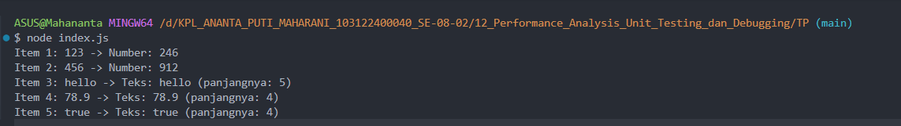

# 📌 Tugas Pendahuluan 12 – Performance Analysis, Unit Testing, dan Debugging

Repository ini berisi implementasi program untuk menyelesaikan tugas **Modul 12 Performance Analysis, Unit Testing, dan Debugging**.

---

## 👩‍💻 Identitas Mahasiswa

**Nama** : Ananta Puti Maharani  
**NIM** : 103122400040  
**Kelas** : SE-08-02  

**Asisten Praktikum** :
- Adhiansyah Muhammad Pradana Farawowan  
- Hamid Khaeruman  

---

## 📖 Soal

Cobalah untuk menangkap kecacatan (bug) pada kode berikut:

```javascript
function main() {
  const data = [
    "123",
    456,
    "hello",
    78.9,
    true,
  ];

  for (let i = 0; i < data.length; i++) {
    const result = processData(data[i]);
    console.log(`Item ${i + 1}: ${data[i]} -> ${result}`);
  }
}

function processData(data) {
  const str = data.toLowerCase();
  const num = parseInt(str);

  if (!isNaN(num) && str === String(num)) {
    return `Number: ${num * 2}`;
  }

  return `Teks: ${str} (panjangnya: ${str.length})`;
}

main();
```

---

## 💻 Kode Sumber

Program ini dibuat menggunakan beberapa file berikut:

- `index.js` → berisi kode program yang telah diperbaiki  
- `README.md` → dokumentasi tugas dan analisis debugging  

---

## 💻 Output



---

## 📝 Analisis Bug

Bug terjadi pada bagian berikut:

```javascript
const str = data.toLowerCase();
```

Method `toLowerCase()` hanya dapat digunakan pada tipe data string.  
Namun array `data` berisi beberapa tipe data lain seperti:

- Number
- Boolean

Akibatnya program menghasilkan error:

```bash
TypeError: data.toLowerCase is not a function
```

---

## ✅ Solusi

Permasalahan diperbaiki dengan mengubah seluruh data menjadi string terlebih dahulu menggunakan fungsi `String()`.

Perbaikan kode:

```javascript
const str = String(data).toLowerCase();
```

Dengan cara ini seluruh tipe data dapat diproses tanpa menyebabkan error.

---

## 💻 Kode Setelah Perbaikan

```javascript
function main() {
  const data = [
    "123",
    456,
    "hello",
    78.9,
    true,
  ];

  for (let i = 0; i < data.length; i++) {
    const result = processData(data[i]);
    console.log(`Item ${i + 1}: ${data[i]} -> ${result}`);
  }
}

function processData(data) {
  const str = String(data).toLowerCase();

  const num = parseInt(str);

  if (!isNaN(num) && str === String(num)) {
    return `Number: ${num * 2}`;
  }

  return `Teks: ${str} (panjangnya: ${str.length})`;
}

main();
```

---

## 📌 Kesimpulan

Kecacatan pada program disebabkan oleh penggunaan method `toLowerCase()` pada tipe data selain string. Setelah dilakukan konversi menggunakan `String()`, program dapat berjalan dengan baik dan seluruh data berhasil diproses tanpa error.